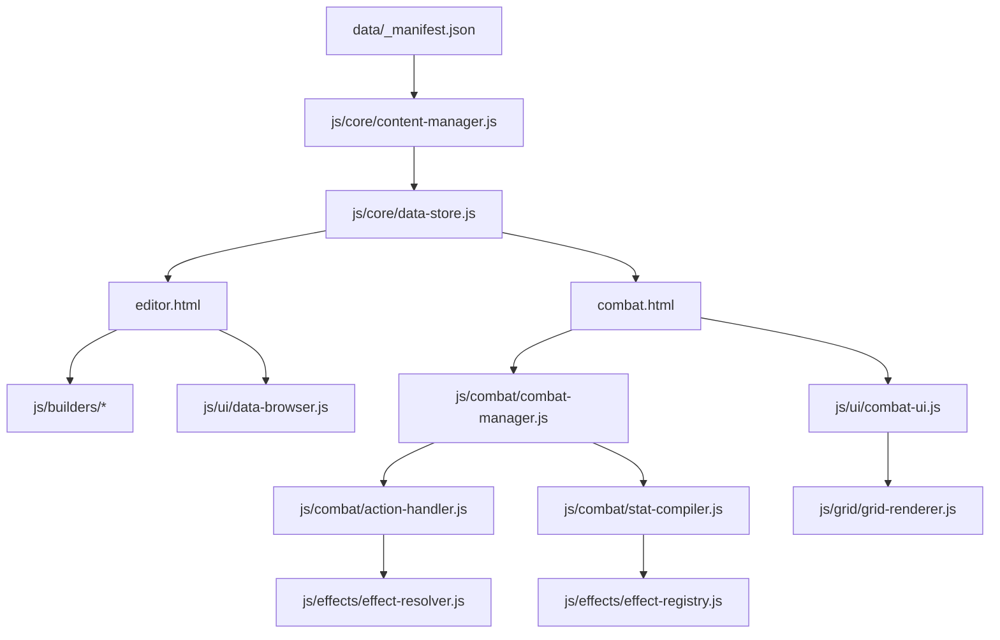

# CJS Developer Guide

This file is the fastest way to understand how the app is wired today.

Use it as:
- a map of the codebase
- a guide for future feature work
- an instruction file for AI so it can read only the files it needs

## 1. Start Here

Main entry points:
- `index.html` - test page / launcher
- `editor.html` - content editor
- `combat.html` - combat simulator

Core runtime files:
- `js/core/constants.js` - enums, rank tables, terrain, status defs, shared rules
- `js/core/formulas.js` - pure HP/MP/DR/damage/evasion/crit/initiative math
- `js/core/dice.js` - dice-string parser + roller
- `js/core/data-store.js` - in-memory source of truth for all loaded content
- `js/core/content-manager.js` - manifest loader, world/scope tagging, migration, validation, file map builder
- `js/core/skill-resolver.js` - canonical skill-reference normalization
- `js/core/undo-manager.js` - undo/redo stack integrated into DataStore
- `js/core/save-manager.js` - GitHub save helpers plus local extract/export helpers

If you are new, read in this order:
1. `DEVELOPER_GUIDE.md`
2. `data/README.md`
3. `data/_manifest.json`
4. `js/core/content-manager.js`
5. `js/core/data-store.js`
6. `editor.html` or `combat.html`, depending on the feature

## 2. Mental Model

The app has 3 layers:

1. Data layer
- files under `data/`
- loaded into `DataStore`
- tagged by scope (`system`, `universal`, `world`)

2. Runtime layer
- combat logic, effect logic, AI, grid, QTE, narrator
- uses `DataStore` records, not raw JSON files directly

3. UI layer
- `editor.html` for content authoring
- `combat.html` for playing a battle
- builder files for each editor panel
- UI helper files for reusable widgets

Important rule:
- Most new features should plug into `DataStore` shape first, then the UI.
- If runtime shape stays stable, combat and editor stay easier to maintain.

## 3. High-Level Flow



## 4. Data System

### 4.1 Multi-file layout

The app is now manifest-first.

Key files:
- `data/_manifest.json` - tells the loader what files exist
- `data/system/*` - global gameplay data
- `data/universal/*` - shared cross-world content
- `data/worlds/<world-id>/*` - world-specific content
- `data/_legacy_bundle.json` - backup of old bundle layout

Main loader:
- `js/core/content-manager.js`

Key jobs of `ContentManager`:
- load manifest files into `DataStore`
- tag records with `_scope`, `_world`, `_origin`
- filter visible content by scope/world
- validate cross-file references
- build file maps for save/export
- run legacy-to-manifest migration

Important functions:
- `loadDefaultData()`
- `validateReferencesDetailed()`
- `getWorldOptions()`
- `buildFileMap()`
- `applyLegacyMigration()`

### 4.2 In-memory source of truth

Main file:
- `js/core/data-store.js`

`DataStore` is the app-wide state container.

Use it for:
- `create(type, obj)`
- `replace(type, id, obj)`
- `update(type, id, changes)`
- `get(type, id)`
- `getAllAsArray(type)`
- `loadData(obj)`
- `exportJSON()`
- `validate()`
- `subscribe(listener)`

Rule:
- UI and combat should read from `DataStore`, not directly from `fetch()`ed files.

## 5. Entry Points

### 5.1 `editor.html`

What it does:
- boots the editor
- loads data through `ContentManager`
- initializes builder panels
- shows scope/world filters
- opens save, GitHub, migration, import, export flows

Important editor responsibilities:
- call `ContentManager.loadDefaultData()`
- call `PortraitPicker.loadManifest()`
- use `ContentManager.buildFileMap()` for save/export
- use `SaveManager` for GitHub save or local extract

Important buttons:
- `Migrate` - stage legacy migration in memory
- `Save` - local only / extract files / GitHub separate / GitHub one commit
- `Export` - full file extraction or bundle fallback

### 5.2 `combat.html`

What it does:
- loads runtime modules in dependency order
- loads data through `ContentManager`
- loads narrator quips
- populates encounter select
- starts `CombatUI`

Combat bootstrap is intentionally simple:
- `combat.html` loads data
- `CombatUI.startCombat(encounterId)` starts the battle
- `CombatManager` owns the live turn loop

### 5.3 `index.html`

This is the lightweight system test page / launcher.

Use it when:
- checking modules are loaded
- checking formulas and dice
- quickly exporting the current bundle

## 6. Editor Architecture

Main files:
- `editor.html`
- `js/ui/ui-helpers.js`
- `js/ui/data-browser.js`
- `js/builders/*.js`

Builder files:
- `js/builders/effect-editor.js`
- `js/builders/status-editor.js`
- `js/builders/passive-editor.js`
- `js/builders/skill-editor.js`
- `js/builders/item-editor.js`
- `js/builders/char-editor.js`
- `js/builders/monster-editor.js`
- `js/builders/encounter-editor.js`

Builder pattern:
1. `init(container)`
2. render list from `DataStore` or `ContentManager.getVisibleItems()`
3. render form for one selected record
4. save via `DataStore.replace()`

Use `char-editor.js` as the reference example for how a full editor is built.

UI helper responsibilities in `js/ui/ui-helpers.js`:
- toast
- modal
- searchable selects
- tag inputs
- number sliders
- list rendering

Data browser:
- `js/ui/data-browser.js`
- read-only table view of all major collections
- useful when content gets big

## 7. Combat Architecture

Main combat files:
- `js/combat/battle-setup.js` - quick/random battle setup screen
- `js/combat/combat-manager.js`
- `js/combat/action-handler.js`
- `js/combat/stat-compiler.js`
- `js/combat/status-manager.js`
- `js/combat/damage-calc.js`
- `js/combat/dice-service.js` - wraps Dice to honor CombatSettings.diceMode
- `js/combat/combat-log.js`
- `js/combat/combat-settings.js`

Combat flow:
1. encounter selected in `combat.html`
2. `CombatUI.startCombat()` starts the fight
3. `CombatManager.startEncounter()` compiles units and initializes grid
4. `CombatManager.runUntilInput()` is pumped repeatedly to advance the turn loop until player input is needed
5. `ActionHandler` validates and executes chosen actions
6. `EffectResolver` fires triggered effects
7. `StatusManager` handles ticks, expiry, and recompile requests
8. `CombatUI` redraws state

What each core file owns:
- `combat-manager.js` - turn loop, phase changes, victory state
- `action-handler.js` - move, attack, skill, item, defend, end turn
- `stat-compiler.js` - convert authored unit data into a live compiled combat unit
- `status-manager.js` - active statuses, stacking, tick damage, passive status effects
- `damage-calc.js` - attack math and damage application

## 8. Effects and Statuses

Effects are the gameplay spine.

Main files:
- `js/effects/effect-registry.js`
- `js/effects/effect-resolver.js`
- `js/effects/value-calc.js`
- `js/effects/conditions.js`

Use them like this:
- `effect-registry.js` - authoring shape, merge overrides, effect metadata, descriptions
- `effect-resolver.js` - runtime trigger execution
- `value-calc.js` - numeric value resolution
- `conditions.js` - condition evaluation for whether effects fire

Statuses:
- `js/combat/status-manager.js`
- built-ins come from `js/core/constants.js`
- custom statuses come from `DataStore.statuses`

Important design rule:
- built-in statuses and custom statuses both work because `StatusManager` does dual lookup

## 9. Grid, Rendering, and Portraits

Grid files:
- `js/grid/grid-engine.js`
- `js/grid/pathfinding.js`
- `js/grid/aoe.js`
- `js/grid/grid-renderer.js`
- `js/grid/map-generator.js` - procedural battle-map generator with biome themes

UI files:
- `js/ui/combat-ui.js`
- `js/ui/portrait-picker.js`
- `js/ui/loot-roller.js` - post-combat loot rolls with Luck bonuses

Portrait system:
- editor widget lives in `js/ui/portrait-picker.js`
- image manifest lives in `data/image-manifest.json`
- images live under:
  - `images/characters/`
  - `images/monsters/`
  - `images/items/`

Important portrait rule:
- portraits are type-based, not world-based
- worlds do not break portraits
- characters use `images/characters/...`
- monsters use `images/monsters/...`
- items use `images/items/...`

Rendering locations:
- `js/grid/grid-renderer.js` - portrait in grid cells
- `js/ui/combat-ui.js` - portrait in initiative bar and unit info card
- editor builder files - portrait picker in forms

## 10. AI, QTE, and Narrator

AI:
- `js/ai/ai-controller.js`
- `js/ai/ai-conditions.js`
- `js/ai/ai-targeting.js`

Use AI files when changing:
- `aiRules` parsing
- target priority
- move/attack/skill choice logic
- fallback behavior

QTE:
- `js/qte/qte-manager.js`
- `js/qte/qte-quickpress.js`
- `js/qte/qte-mash.js`
- `js/qte/qte-fishing.js`
- `js/qte/qte-rhythm.js`
- `js/qte/qte-quiz.js`

Narrator:
- `js/narrator/narrator-data.js`
- `js/narrator/narrator-engine.js`
- `js/narrator/narrator-state.js`

Quip source:
- system quips are in `data/system/quips.json`
- some world quips can also exist in world files

## 11. Save, Export, Migration

Main file:
- `js/core/save-manager.js`

Current save paths:
- GitHub save per file
- GitHub save as one commit
- local browser draft save
- folder extract to repo root
- bundle-file fallback download if directory writing is unavailable

Current editor export rule:
- when using `Extract Files`, choose the repo root folder
- the correct folder is the one containing:
  - `editor.html`
  - `combat.html`
  - `data/`
  - `js/`
  - `css/`

Migration file:
- `js/core/content-manager.js`

Migration artifacts:
- `MIGRATION_REPORT.md`
- `data/_legacy_bundle.json`

## 12. If You Want To Change X, Read These Files

### Add or change a world
- `data/_manifest.json`
- `data/worlds/<world-id>/_meta.json`
- `js/core/content-manager.js`
- `editor.html` if you need filter/save UI changes

### Add a new content category
- `js/core/constants.js` if IDs or enums are needed
- `js/core/data-store.js`
- `js/core/content-manager.js`
- `js/ui/data-browser.js`
- `editor.html` if save/filter UX must expose it
- add a builder file only if you want a custom editor panel

### Change character, monster, item fields
- matching builder file in `js/builders/`
- `js/combat/stat-compiler.js` if the field affects combat stats
- `js/combat/action-handler.js` if the field changes actions
- `js/core/skill-resolver.js` when skill refs or overrides are involved
- `js/core/data-store.js` only if normalization/export rules must change

### Change how combat turns work
- `js/combat/combat-manager.js`
- `js/combat/combat-settings.js`
- `js/ui/combat-ui.js`

### Change damage, hit logic, or skill execution
- `js/combat/action-handler.js`
- `js/combat/damage-calc.js`
- `js/combat/dice-service.js`
- `js/effects/effect-resolver.js`
- `js/combat/stat-compiler.js`
- `js/core/formulas.js`
- `js/core/dice.js`

### Change status behavior
- `js/combat/status-manager.js`
- `js/core/constants.js` for built-ins
- `js/builders/status-editor.js` for editor UX

### Change effects or add a new effect action
- `js/effects/effect-registry.js`
- `js/effects/effect-resolver.js`
- `js/effects/value-calc.js`
- `js/effects/conditions.js`
- `js/builders/effect-editor.js`

### Change AI behavior
- `js/ai/ai-controller.js`
- `js/ai/ai-conditions.js`
- `js/ai/ai-targeting.js`

### Change quick-battle / map setup
- `js/combat/battle-setup.js`
- `js/grid/map-generator.js`

### Change grid movement, terrain, range, or AoE
- `js/grid/grid-engine.js`
- `js/grid/pathfinding.js`
- `js/grid/aoe.js`
- `js/grid/grid-renderer.js`
- `js/grid/map-generator.js`
- `js/core/constants.js` for terrain definitions

### Change portraits
- `js/ui/portrait-picker.js`
- `data/image-manifest.json`
- `js/grid/grid-renderer.js`
- `js/ui/combat-ui.js`
- one relevant builder file

### Change post-combat loot
- `js/ui/loot-roller.js`
- `js/ui/combat-ui.js`

### Change undo/redo
- `js/core/undo-manager.js`
- `js/core/data-store.js`

### Change editor save/export behavior
- `editor.html`
- `js/core/save-manager.js`
- `js/core/content-manager.js`

## 13. Recommended Read Sets For Future AI

If the task is about data loading or world split:
- `data/README.md`
- `data/_manifest.json`
- `js/core/content-manager.js`
- `js/core/data-store.js`

If the task is about editor forms:
- `editor.html`
- one builder file only
- `js/ui/ui-helpers.js`

If the task is about combat:
- `combat.html`
- `js/combat/combat-manager.js`
- `js/combat/action-handler.js`
- `js/combat/stat-compiler.js`
- whichever module the feature touches

If the task is about portraits:
- `js/ui/portrait-picker.js`
- `js/ui/combat-ui.js`
- `js/grid/grid-renderer.js`
- one relevant builder file
- `data/image-manifest.json`

If the task is about save/export:
- `editor.html`
- `js/core/save-manager.js`
- `js/core/content-manager.js`

## 14. Current Known Limits

These are not bugs, just current structure limits:
- `food`, `materials`, `crafting`, `crops`, `shops`, `zones`, and `stories` are wired into load/save/browser flow, but most do not yet have dedicated custom editors
- import flow is still simpler than the full multi-file save flow
- editor GitHub save depends on user token setup in browser storage

## 15. Safe Dev Workflow

When changing code:
1. update the smallest relevant module first
2. keep `DataStore` shape stable when possible
3. only expand `ContentManager` if the file layout or save/load contract changes
4. update editor builder files only for authoring UX
5. run regression tests after non-trivial changes

Regression test file:
- `test_engine.js`

Run:

```bash
node test_engine.js
```

Use this before pushing changes that touch:
- load/save
- combat flow
- skills
- AI
- statuses
- migration

## 16. Short Summary

If you remember only one thing, remember this:

- `ContentManager` decides what files are loaded
- `DataStore` is the runtime truth
- builder files edit authored data
- combat files consume compiled runtime data
- `SaveManager` writes data back out

That separation is what keeps the project scalable as worlds and content grow.

## 17. Audio and Animation

Combat now has a thin presentation layer that listens to existing
`CombatManager` pub/sub events. Combat math never reads from it, so
audio + animation are safe to disable or extend without touching
gameplay code.

Files:
- `js/ui/audio-manager.js` - SFX pool + single BGM `<audio>` element, volume/mute persisted to localStorage
- `js/ui/animation-bus.js` - tiny event bus combat code emits onto
- `css/combat-animations.css` - the 5 keyframe sets + BGM control panel styles
- `js/builders/audio-library.js` - editor panel for uploading audio files and editing the manifest
- `data/audio-manifest.json` - `{ sfx: { id: path|string[] }, bgm: { id: path|string[] } }`
- `audio/sfx/`, `audio/bgm/` - actual audio files (starter pack + user uploads)

Built-in SFX keys (resolved by `AudioManager.playSfx`):
- Weapon by shape: `weapon_slash`, `weapon_pierce`, `weapon_blunt`
- Weapon by element: `weapon_hit_physical`, `weapon_hit_fire`, `weapon_hit_ice`, `weapon_hit_lightning`, `weapon_hit_water`, `weapon_hit_wind`, `weapon_hit_earth`, `weapon_hit_holy`, `weapon_hit_dark`
- Magic: `magic_cast`, `magic_hit`, `magic_fire`, `magic_ice`, `magic_lightning`, `magic_holy`, `magic_dark`
- Movement / defense / reactions: `move_step`, `defend_guard`, `miss`, `heal`, `crit_sting`, `absorb_guard`
- Combat events: `critical`, `dodge`, `defend`, `victory`, `defeat`, `level_up`
- Items: `item_use`, `item_potion`, `item_buff`, `item_throw`
- Statuses: `status_apply`, `status_buff`, `status_debuff`
- KO: `ko`
- UI: `ui_click`, `ui_cursor`, `ui_confirm`, `ui_cancel`, `ui_error`

Each built-in key resolves through `audio-manager.js`'s manifest lookup plus
its synthesized fallback / alias chain. Uploading an audio file with the same
id in the Audio Library replaces the fallback for that key.

Skills can override SFX directly via two optional fields on the skill record:
- `castSfx` - id played when the skill is cast
- `hitSfx` - id played on each hit (overrides default routing)
The skill editor's Audio section exposes both as dropdowns populated from the manifest + built-in keys.

Starter assets bundled in the repo:
- BGM: `battle_1`, `codex_battle_loop`, `codex_shadow_skirmish`
- SFX: `ui_click`, `weapon_hit_physical`, `weapon_hit_fire`, `weapon_hit_ice`,
  `weapon_hit_lightning`, `weapon_hit_water`, `magic_cast`, `magic_hit`,
  `move_step`, `defend_guard`, `miss`, `heal`, `crit_sting`, `absorb_guard`,
  `item_use`, `status_apply`, `ko`

Manifest values can be either a single path or an array of variant paths.
When an array is present, `AudioManager` picks one variant at random each play
and applies a slight playback-rate jitter so repeated actions do not sound
identical.

Encounter records can carry a `bgm` field:
- string id - that single track plays
- string array - random pick from the pool on battle start
- omitted - falls back to `CombatSettings.getDefaultBgmPool()`

Animation events emitted from combat:
- `unit_move` - payload `{ unit, from, to }` (renders travel streaks, arrival pulse, and path dots)
- `damage` - target hit spark, damage labels, and guard labels for absorbed damage
- `hit` - payload `{ attacker, target, skill?, element, weaponShape?, isCritical }` (renders directional slash + shake on attacker / target)
- `heal` - green pulse and floating heal value
- `miss` - miss reticle, trace, and floating `MISS`
- `skill_cast` - cell pulse on caster
- `unit_ko` - fade + scale-down on the dying cell
- `turn_start` - fly-in banner with the round and unit name

Toggle animations live with the checkbox in the combat sidebar
(`CombatSettings.setAnimationsEnabled(false)` in code). Mute audio with
the speaker button or `AudioManager.mute(true)`.

Authoring + saving an audio file:
1. Editor sidebar -> **Audio Library**
2. Pick SFX or BGM tab
3. Type an id, choose a supported audio file (`.mp3`, `.ogg`, `.wav`), click Upload
4. SaveManager base64-encodes the file and PUTs it to GitHub at
   `audio/<sfx|bgm>/<id>.<ext>`, then re-saves `data/audio-manifest.json`
5. Reference the id from an encounter's `bgm` field, or rely on the
   built-in SFX keys above.

If you want to change audio behavior:
- file routing for SFX hits - `js/combat/action-handler.js`
- KO sound - `js/combat/combat-manager.js` (`_handleDeath`)
- status applied sound - `js/combat/status-manager.js`
- damage flash / KO fade / cast / move / banner visuals - `js/ui/combat-ui.js` (`_animXxx`) + `css/combat-animations.css`
- BGM resolution at battle start - `js/ui/combat-ui.js` (`_startEncounterBgm`)
