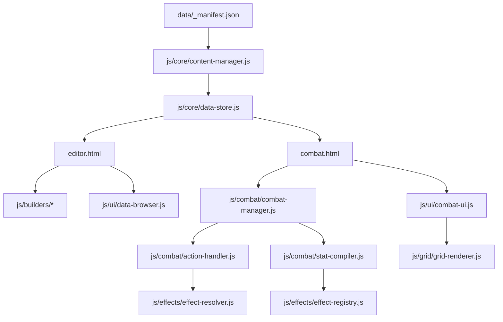

# CJS Developer Guide

This file is the fastest way to understand how the app is wired today.

Use it as:
- a map of the codebase
- a guide for future feature work
- an instruction file for AI so it can read only the files it needs

## 1. Start Here

Main entry points:
- `index.html` - test page / launcher
- `editor.html` - content editor
- `combat.html` - combat simulator
- `campaign.html` - campaign GM dashboard, scenario runner, Story Director, and tabletop ledger

Core runtime files:
- `js/core/constants.js` - enums, rank tables, terrain, status defs, shared rules
- `js/core/formulas.js` - pure HP/MP/DR/damage/evasion/crit/initiative math
- `js/core/dice.js` - dice-string parser + roller
- `js/core/data-store.js` - in-memory source of truth for all loaded content
- `js/core/content-manager.js` - manifest loader, world/scope tagging, migration, validation, file map builder
- `js/core/skill-resolver.js` - canonical skill-reference normalization
- `js/core/undo-manager.js` - undo/redo stack integrated into DataStore
- `js/core/save-manager.js` - GitHub save helpers plus local extract/export helpers

If you are new, read in this order:
1. `DEVELOPER_GUIDE.md`
2. `data/README.md`
3. `data/_manifest.json`
4. `js/core/content-manager.js`
5. `js/core/data-store.js`
6. `editor.html` or `combat.html`, depending on the feature

## 2. Mental Model

The app has 3 layers:

1. Data layer
- files under `data/`
- loaded into `DataStore`
- tagged by scope (`system`, `universal`, `world`)

2. Runtime layer
- combat logic, effect logic, AI, grid, QTE, narrator
- uses `DataStore` records, not raw JSON files directly

3. UI layer
- `editor.html` for content authoring
- `combat.html` for playing a battle
- builder files for each editor panel
- UI helper files for reusable widgets

Important rule:
- Most new features should plug into `DataStore` shape first, then the UI.
- If runtime shape stays stable, combat and editor stay easier to maintain.
- Plot-heavy campaign features should be table-driven where possible. For Story Director work, edit `data/campaigns/<world>/story_director/` and `docs/CJS_STORY_DIRECTOR_REFERENCE.md` before changing engine code.

## 3. High-Level Flow


```mermaid
flowchart TD
    A["data/_manifest.json"] --> B["js/core/content-manager.js"]
    B --> C["js/core/data-store.js"]
    C --> D["editor.html"]
    C --> E["combat.html"]
    D --> F["js/builders/*"]
    D --> G["js/ui/data-browser.js"]
    E --> H["js/combat/combat-manager.js"]
    H --> I["js/combat/action-handler.js"]
    H --> J["js/combat/stat-compiler.js"]
    I --> K["js/effects/effect-resolver.js"]
    J --> L["js/effects/effect-registry.js"]
    E --> M["js/ui/combat-ui.js"]
    M --> N["js/grid/grid-renderer.js"]
```

## 4. Data System

### 4.1 Multi-file layout

The app is now manifest-first.

Key files:
- `data/_manifest.json` - tells the loader what files exist
- `data/system/*` - global gameplay data
- `data/universal/*` - shared cross-world content
- `data/worlds/<world-id>/*` - world-specific content
- `data/_legacy_bundle.json` - backup of old bundle layout

Main loader:
- `js/core/content-manager.js`

Key jobs of `ContentManager`:
- load manifest files into `DataStore`
- tag records with `_scope`, `_world`, `_origin`
- filter visible content by scope/world
- validate cross-file references
- build file maps for save/export
- run legacy-to-manifest migration

Important functions:
- `loadDefaultData()`
- `validateReferencesDetailed()`
- `getWorldOptions()`
- `buildFileMap()`
- `applyLegacyMigration()`

### 4.2 In-memory source of truth

Main file:
- `js/core/data-store.js`

`DataStore` is the app-wide state container.

Use it for:
- `create(type, obj)`
- `replace(type, id, obj)`
- `update(type, id, changes)`
- `get(type, id)`
- `getAllAsArray(type)`
- `loadData(obj)`
- `exportJSON()`
- `validate()`
- `subscribe(listener)`

Rule:
- UI and combat should read from `DataStore`, not directly from `fetch()`ed files.

## 5. Entry Points

### 5.1 `editor.html`

What it does:
- boots the editor
- loads data through `ContentManager`
- initializes builder panels
- shows scope/world filters
- opens save, GitHub, migration, import, export flows

Important editor responsibilities:
- call `ContentManager.loadDefaultData()`
- call `PortraitPicker.loadManifest()`
- use `ContentManager.buildFileMap()` for save/export
- use `SaveManager` for GitHub save or local extract

Important buttons:
- `Migrate` - stage legacy migration in memory
- `Save` - local only / extract files / GitHub separate / GitHub one commit
- `Export` - full file extraction or bundle fallback

### 5.2 `combat.html`

What it does:
- loads runtime modules in dependency order
- loads data through `ContentManager`
- loads narrator quips
- populates encounter select
- starts `CombatUI`

Combat bootstrap is intentionally simple:
- `combat.html` loads data
- `CombatUI.startCombat(encounterId)` starts the battle
- `CombatManager` owns the live turn loop

### 5.3 `index.html`

This is the lightweight system test page / launcher.

Use it when:
- checking modules are loaded
- checking formulas and dice
- quickly exporting the current bundle

## 6. Editor Architecture

Main files:
- `editor.html`
- `js/ui/ui-helpers.js`
- `js/ui/data-browser.js`
- `js/builders/*.js`

Builder files:
- `js/builders/effect-editor.js`
- `js/builders/status-editor.js`
- `js/builders/passive-editor.js`
- `js/builders/skill-editor.js`
- `js/builders/item-editor.js`
- `js/builders/char-editor.js`
- `js/builders/monster-editor.js`
- `js/builders/encounter-editor.js`

Builder pattern:
1. `init(container)`
2. render list from `DataStore` or `ContentManager.getVisibleItems()`
3. render form for one selected record
4. save via `DataStore.replace()`

Use `char-editor.js` as the reference example for how a full editor is built.

UI helper responsibilities in `js/ui/ui-helpers.js`:
- toast
- modal
- searchable selects
- tag inputs
- number sliders
- list rendering

Data browser:
- `js/ui/data-browser.js`
- read-only table view of all major collections
- useful when content gets big

## 7. Combat Architecture

Main combat files:
- `js/combat/battle-setup.js` - quick/random battle setup screen
- `js/combat/combat-manager.js`
- `js/combat/combat-objectives.js` - pluggable kill-all/escort/capture/survival/assassination objectives
- `js/combat/action-handler.js`
- `js/combat/stat-compiler.js`
- `js/combat/status-manager.js`
- `js/combat/damage-calc.js`
- `js/combat/dice-service.js` - wraps Dice to honor CombatSettings.diceMode
- `js/combat/combat-log.js`
- `js/combat/combat-settings.js`

Adding a new combat objective:
1. Pick a kind name and add it to `CombatObjectives.KINDS`.
2. Implement `_evalKind(tracker, state)` returning `null | { winner, reason }`.
3. Add `_describeKind(tracker, state)` for the UI banner label/progress.
4. Author encounters with `objective: { kind: "your_kind", ...config }`.
5. The combat-manager calls `evaluate` first; only falls back to legacy
   kill-all when no objective is configured.

Combat flow:
1. encounter selected in `combat.html`
2. `CombatUI.startCombat()` starts the fight
3. `CombatManager.startEncounter()` compiles units and initializes grid
4. `CombatManager.runUntilInput()` is pumped repeatedly to advance the turn loop until player input is needed
5. `ActionHandler` validates and executes chosen actions
6. `EffectResolver` fires triggered effects
7. `StatusManager` handles ticks, expiry, and recompile requests
8. `CombatUI` redraws state

What each core file owns:
- `combat-manager.js` - turn loop, phase changes, victory state
- `action-handler.js` - move, attack, skill, item, defend, end turn
- `stat-compiler.js` - convert authored unit data into a live compiled combat unit
- `status-manager.js` - active statuses, stacking, tick damage, passive status effects
- `damage-calc.js` - attack math and damage application

## 8. Effects and Statuses

Effects are the gameplay spine.

Main files:
- `js/effects/effect-registry.js`
- `js/effects/effect-resolver.js`
- `js/effects/value-calc.js`
- `js/effects/conditions.js`

Use them like this:
- `effect-registry.js` - authoring shape, merge overrides, effect metadata, descriptions
- `effect-resolver.js` - runtime trigger execution
- `value-calc.js` - numeric value resolution
- `conditions.js` - condition evaluation for whether effects fire

Statuses:
- `js/combat/status-manager.js`
- built-ins come from `js/core/constants.js`
- custom statuses come from `DataStore.statuses`

Important design rule:
- built-in statuses and custom statuses both work because `StatusManager` does dual lookup

## 9. Grid, Rendering, and Portraits

Grid files:
- `js/grid/grid-engine.js`
- `js/grid/pathfinding.js`
- `js/grid/aoe.js`
- `js/grid/grid-renderer.js`
- `js/grid/map-generator.js` - procedural battle-map generator with biome themes

UI files:
- `js/ui/combat-ui.js`
- `js/ui/portrait-picker.js`
- `js/ui/loot-roller.js` - post-combat loot rolls with Luck bonuses

Portrait system:
- editor widget lives in `js/ui/portrait-picker.js`
- image manifest lives in `data/image-manifest.json`
- images live under:
  - `images/characters/`
  - `images/monsters/`
  - `images/items/`

Important portrait rule:
- portraits are type-based, not world-based
- worlds do not break portraits
- characters use `images/characters/...`
- monsters use `images/monsters/...`
- items use `images/items/...`

Portrait focus (crop):
- entities may carry an optional `portraitFocus: { x, y, zoom }` field
  - `x`, `y` in [0, 100] pick the focus point as a % of the source image
  - `zoom` in [100, 400] (%) optionally zooms in around the focus point
  - missing/null = defaults to centered, no zoom
- the editor portrait widget exposes `getFocus()` / `setFocus()` and a
  drag-to-focus + zoom-slider UI behind a "Focus" toggle
- `PortraitPicker.focusStyle(focus)` returns an inline style string
  (object-fit, object-position, transform-origin, transform:scale) for
  `` tags, and `PortraitPicker.drawPortraitToCanvas(...)` does the
  equivalent source-crop for canvas drawing in the grid

Rendering locations:
- `js/grid/grid-renderer.js` - portrait in grid cells (uses canvas crop)
- `js/ui/combat-ui.js` - portrait in initiative bar and unit info card
- `js/campaign/campaign-ui.js` - roster card, party avatar, hero portrait,
  banter portrait (all use focus style)
- `js/campaign/campaign-combat-popup.js` - monster thumbnails
- editor builder files - portrait picker in forms

## 10. AI, QTE, and Narrator

AI:
- `js/ai/ai-controller.js`
- `js/ai/ai-conditions.js`
- `js/ai/ai-targeting.js`

Use AI files when changing:
- `aiRules` parsing
- target priority
- move/attack/skill choice logic
- fallback behavior

QTE:
- `js/qte/qte-manager.js`
- `js/qte/qte-quickpress.js`
- `js/qte/qte-mash.js`
- `js/qte/qte-fishing.js`
- `js/qte/qte-rhythm.js`
- `js/qte/qte-quiz.js`

Narrator:
- `js/narrator/narrator-data.js`
- `js/narrator/narrator-engine.js`
- `js/narrator/narrator-state.js`

Quip source:
- system quips are in `data/system/quips.json`
- some world quips can also exist in world files

## 11. Save, Export, Migration

Main file:
- `js/core/save-manager.js`

Current save paths:
- GitHub save per file
- GitHub save as one commit
- local browser draft save
- folder extract to repo root
- bundle-file fallback download if directory writing is unavailable

Current editor export rule:
- when using `Extract Files`, choose the repo root folder
- the correct folder is the one containing:
  - `editor.html`
  - `combat.html`
  - `data/`
  - `js/`
  - `css/`

Migration file:
- `js/core/content-manager.js`

Migration artifacts:
- `MIGRATION_REPORT.md`
- `data/_legacy_bundle.json`

## 12. If You Want To Change X, Read These Files

### Add or change a world
- `data/_manifest.json`
- `data/worlds/<world-id>/_meta.json`
- `js/core/content-manager.js`
- `editor.html` if you need filter/save UI changes

### Add a new content category
- `js/core/constants.js` if IDs or enums are needed
- `js/core/data-store.js`
- `js/core/content-manager.js`
- `js/ui/data-browser.js`
- `editor.html` if save/filter UX must expose it
- add a builder file only if you want a custom editor panel

### Change character, monster, item fields
- matching builder file in `js/builders/`
- `js/combat/stat-compiler.js` if the field affects combat stats
- `js/combat/action-handler.js` if the field changes actions
- `js/core/skill-resolver.js` when skill refs or overrides are involved
- `js/core/data-store.js` only if normalization/export rules must change

### Change how combat turns work
- `js/combat/combat-manager.js`
- `js/combat/combat-settings.js`
- `js/ui/combat-ui.js`

### Change damage, hit logic, or skill execution
- `js/combat/action-handler.js`
- `js/combat/damage-calc.js`
- `js/combat/dice-service.js`
- `js/effects/effect-resolver.js`
- `js/combat/stat-compiler.js`
- `js/core/formulas.js`
- `js/core/dice.js`

### Change status behavior
- `js/combat/status-manager.js`
- `js/core/constants.js` for built-ins
- `js/builders/status-editor.js` for editor UX

### Change effects or add a new effect action
- `js/effects/effect-registry.js`
- `js/effects/effect-resolver.js`
- `js/effects/value-calc.js`
- `js/effects/conditions.js`
- `js/builders/effect-editor.js`

### Change AI behavior
- `js/ai/ai-controller.js`
- `js/ai/ai-conditions.js`
- `js/ai/ai-targeting.js`

### Change quick-battle / map setup
- `js/combat/battle-setup.js`
- `js/grid/map-generator.js`

### Change grid movement, terrain, range, or AoE
- `js/grid/grid-engine.js`
- `js/grid/pathfinding.js`
- `js/grid/aoe.js`
- `js/grid/grid-renderer.js`
- `js/grid/map-generator.js`
- `js/core/constants.js` for terrain definitions

### Change portraits
- `js/ui/portrait-picker.js`
- `data/image-manifest.json`
- `js/grid/grid-renderer.js`
- `js/ui/combat-ui.js`
- one relevant builder file

### Change post-combat loot
- `js/ui/loot-roller.js`
- `js/ui/combat-ui.js`

### Change undo/redo
- `js/core/undo-manager.js`
- `js/core/data-store.js`

### Change editor save/export behavior
- `editor.html`
- `js/core/save-manager.js`
- `js/core/content-manager.js`

## 13. Recommended Read Sets For Future AI

If the task is about data loading or world split:
- `data/README.md`
- `data/_manifest.json`
- `js/core/content-manager.js`
- `js/core/data-store.js`

If the task is about editor forms:
- `editor.html`
- one builder file only
- `js/ui/ui-helpers.js`

If the task is about combat:
- `combat.html`
- `js/combat/combat-manager.js`
- `js/combat/action-handler.js`
- `js/combat/stat-compiler.js`
- whichever module the feature touches

If the task is about portraits:
- `js/ui/portrait-picker.js`
- `js/ui/combat-ui.js`
- `js/grid/grid-renderer.js`
- one relevant builder file
- `data/image-manifest.json`

If the task is about save/export:
- `editor.html`
- `js/core/save-manager.js`
- `js/core/content-manager.js`

## 14. Current Known Limits

These are not bugs, just current structure limits:
- `food`, `materials`, `crafting`, `crops`, `shops`, `zones`, and `stories` are wired into load/save/browser flow, but most do not yet have dedicated custom editors
- import flow is still simpler than the full multi-file save flow
- editor GitHub save depends on user token setup in browser storage

## 15. Safe Dev Workflow

When changing code:
1. update the smallest relevant module first
2. keep `DataStore` shape stable when possible
3. only expand `ContentManager` if the file layout or save/load contract changes
4. update editor builder files only for authoring UX
5. run regression tests after non-trivial changes

Regression test file:
- `test_engine.js`

Run:

```bash
node test_engine.js
```

Use this before pushing changes that touch:
- load/save
- combat flow
- skills
- AI
- statuses
- migration

## 16. Campaign Mode Scenario System

Campaign Mode lives at `campaign.html` and uses the `js/campaign/*` modules.
It is save-first: authored content is loaded through `DataStore`, while
generated scenario content is stored inside the active campaign save.

Core files:
- `js/campaign/campaign-state.js` - campaign save normalization, authored content lookup, generated scenario/map lookup
- `js/campaign/scenario-runner.js` - starts, advances, moves through, and reports scenario runs
- `js/campaign/campaign-map.js` - layered node-map renderer for active scenario maps
- `js/campaign/campaign-scenario-generator.js` - save-local random, quest, and quest-chain scenario generator
- `js/campaign/campaign-ui.js` - Scenario tabs, generator controls, run controls, battle/event handoff

Supported scenario travel modes:
- `node_map` - uses an authored or generated scenario map by `mapId`
- `procedural` - expands a `mapSeedId` or matching `mapSeedTags` into a node map at run start
- `linear` - advances through ordered `beats`
- `freeform` - no map; GM uses random/pick/custom battle and event controls

Generated scenarios:
- are created from the Scenario > Briefing generator controls
- can use source `random`, `active_quest`, or `quest_chain`
- accept map type `urban`, `outdoor`, `dungeon`, `house`, `castle`, `mountain`, or `any`
- accept size `tiny`, `small`, `medium`, or `large`
- accept 1-3 layers
- are saved under `state.sideContent.generatedScenarios`
- store generated maps under `state.sideContent.generatedMaps`
- start through `ScenarioRunner.startScenario()`, just like authored scenarios

Layered maps:
- map nodes may use `layer` or `layerId`
- map definitions may include `layers: [{ id, name }]`
- the renderer shows one layer at a time and switches layers via `activeScenarioRun.mapLayer`
- movement reveals the destination plus adjacent nodes so routes are readable while still preserving exploration

Battle references in scenario maps:
- `battleSetIds` should reference battle set cards when possible
- `encounterId` or `encounterIds` may reference direct combat encounters
- procedural and generated maps resolve both forms before queuing a pending battle

Starter generator map seeds are in:
- `data/campaigns/haven/map_seeds/haven_generator_map_seeds.json`

Grid scenario maps:
- supported map type: `grid_map`
- authored maps live in `data/campaigns/<world>/maps/*.map.json`
- set scenario `travelMode: "grid_map"`, `mapId`, and `startCell: [x, y]`
- map fields: `width`, `height`, `terrain`, `defaultStartCell`, and `cells`
- terrain values `wall`, `obstacle`, `blocked`, and `void` are impassable
- cell records can include `x`, `y`, `kind`, `title`, `notes`, `tags`, `onEnter`, and `randomBattle`
- success can use `{ "type": "reach_cell", "x": 5, "y": 1 }`
- the Scenario generator has a Form selector: `node_map` or `grid_map`

Party availability:
- campaign saves store `party.<id>.availability`
- statuses are `available`, `unavailable`, `busy`, `injured`, or `story_locked`
- manual UI: party card -> Availability
- combat bridge sends only battle-ready party members to `combat.html`
- automatic rules:
  - 0 HP at scenario start marks a member `injured` until scenario end
  - scenario records can define `partyRestrictions` entries:
    `{ "characterId": "haven_garr", "status": "busy", "reason": "...", "expires": "scenario" }`
- use ops for scripts/events:
  - `{ "op": "set_party_availability", "target": "haven_garr", "status": "busy", "reason": "...", "expires": "scenario" }`
  - `{ "op": "clear_party_availability", "target": "haven_garr" }`

Party chatter:
- JSON source: `data/campaigns/haven/side_content/party_banter.json`
- loader: `js/campaign/campaign-party-chat.js`
- add future dialogue under `sets`, not prompt text
- set lookup order is map, scenario, quest, story, event, location, situation, then `normal`
- common entry fields: `id`, `speaker`, `target`, `line`, `reply`, `tags`, `requiredTags`, `requiresPresent`, `excludesPresent`, `weight`
- specific set names use prefixes such as `map:haven_map_frostwood_short_route`, `story:haven_story_guild_dain_route_choice`, `event:haven_frostwood_events`, or `quest:quest_firemoss_cache_run`
- `location` sets can match node/cell kinds such as `battle`, `trap`, `reward`, `grid`, `exit`
- the roller filters out unavailable party members automatically

Campaign battle app bridge:
- request/result handoff lives in `js/campaign/campaign-combat-bridge.js`
- result storage uses `sessionStorage`, `localStorage`, `BroadcastChannel`, and `postMessage`
- this is intentional so a battle opened in a separate tab can still report loot back to Campaign Mode
- result loot is summarized in both `combat.html` and the Campaign Mode result panel

Campaign economy:
- campaign saves track arbitrary `currencies`, not only gold
- `jp` is displayed as Jester Points
- shop records can set a shop-level `currency` or stock-level `currency`
- stock entries can use:
  - `requires` for ownership gates that are not consumed
  - `costs` or `costBundle` for extra consumed item/material/currency costs
  - `consumeRequires: true` if requirements should also be consumed
- system/special shop examples are in `data/worlds/haven/shops.json`

## 17. Short Summary

If you remember only one thing, remember this:

- `ContentManager` decides what files are loaded
- `DataStore` is the runtime truth
- builder files edit authored data
- combat files consume compiled runtime data
- `SaveManager` writes data back out

That separation is what keeps the project scalable as worlds and content grow.

## 18. Audio and Animation

Combat now has a thin presentation layer that listens to existing
`CombatManager` pub/sub events. Combat math never reads from it, so
audio + animation are safe to disable or extend without touching
gameplay code.

Files:
- `js/ui/audio-manager.js` - SFX pool + single BGM `<audio>` element, volume/mute persisted to localStorage
- `js/ui/animation-bus.js` - tiny event bus combat code emits onto
- `css/combat-animations.css` - the 5 keyframe sets + BGM control panel styles
- `js/builders/audio-library.js` - editor panel for uploading audio files and editing the manifest
- `data/audio-manifest.json` - `{ sfx: { id: path|string[] }, bgm: { id: path|string[] } }`
- `audio/sfx/`, `audio/bgm/` - actual audio files (starter pack + user uploads)

Built-in SFX keys (resolved by `AudioManager.playSfx`):
- Weapon by shape: `weapon_slash`, `weapon_pierce`, `weapon_blunt`
- Weapon by element: `weapon_hit_physical`, `weapon_hit_fire`, `weapon_hit_ice`, `weapon_hit_lightning`, `weapon_hit_water`, `weapon_hit_wind`, `weapon_hit_earth`, `weapon_hit_holy`, `weapon_hit_dark`
- Magic: `magic_cast`, `magic_hit`, `magic_fire`, `magic_ice`, `magic_lightning`, `magic_holy`, `magic_dark`
- Movement / defense / reactions: `move_step`, `defend_guard`, `miss`, `heal`, `crit_sting`, `absorb_guard`
- Reserved voice slots: `bin_fight`, `bin_hurt`, `bin_happy`, `bin_angry`, `weapon_bow_shot`, `zombie_attack`, `zombie_hurt`, plus Peri v2 L2D ids prefixed `peri_v2_l2d_`
- Combat events: `critical`, `dodge`, `defend`, `victory`, `defeat`, `level_up`
- Items: `item_use`, `item_potion`, `item_buff`, `item_throw`
- Statuses: `status_apply`, `status_buff`, `status_debuff`
- KO: `ko`
- UI: `ui_click`, `ui_cursor`, `ui_confirm`, `ui_cancel`, `ui_error`

Each built-in key resolves through `audio-manager.js`'s manifest lookup plus
its synthesized fallback / alias chain. Uploading an audio file with the same
id in the Audio Library replaces the fallback for that key.

Skills can override SFX directly via two optional fields on the skill record:
- `castSfx` - id played when the skill is cast
- `hitSfx` - id played on each hit (overrides default routing)
The skill editor's Audio section exposes both as dropdowns populated from the manifest + built-in keys.

Characters and monsters can also carry a `battleSfx` object for voice or
creature reactions. The character editor exposes `attack`, `hurt`, `happy`,
`angry`, `expression`, and `archerAttack`; the monster editor exposes
`attack` and `hurt`. Bin is prewired to `bin_fight`, `bin_hurt`,
`bin_happy`, and `bin_angry`; current zombie monsters are prewired to
`zombie_attack` and `zombie_hurt`. Empty slots stay silent until an explicit
id is assigned and uploaded.

Starter assets bundled in the repo:
- BGM: `battle_1`, `codex_battle_loop`, `codex_shadow_skirmish`
- SFX: `ui_click`, `weapon_hit_physical`, `weapon_hit_fire`, `weapon_hit_ice`,
  `weapon_hit_lightning`, `weapon_hit_water`, `magic_cast`, `magic_hit`,
  `move_step`, `defend_guard`, `miss`, `heal`, `crit_sting`, `absorb_guard`,
  `item_use`, `status_apply`, `ko`

Manifest values can be either a single path or an array of variant paths.
When an array is present, `AudioManager` picks one variant at random each play
and applies a slight playback-rate jitter so repeated actions do not sound
identical.

Encounter records can carry a `bgm` field:
- string id - that single track plays
- string array - random pick from the pool on battle start
- omitted - falls back to `CombatSettings.getDefaultBgmPool()`

Animation events emitted from combat:
- `unit_move` - payload `{ unit, from, to }` (renders travel streaks, arrival pulse, and path dots)
- `damage` - target hit spark, damage labels, and guard labels for absorbed damage
- `hit` - payload `{ attacker, target, skill?, element, weaponShape?, isCritical }` (renders directional slash + shake on attacker / target)
- `heal` - green pulse and floating heal value
- `miss` - miss reticle, trace, and floating `MISS`
- `skill_cast` - cell pulse on caster
- `unit_ko` - fade + scale-down on the dying cell
- `turn_start` - fly-in banner with the round and unit name

Toggle animations live with the checkbox in the combat sidebar
(`CombatSettings.setAnimationsEnabled(false)` in code). Mute audio with
the speaker button or `AudioManager.mute(true)`.

Authoring + saving an audio file:
1. Editor sidebar -> **Audio Library**
2. Pick SFX or BGM tab
3. Type an id, choose a supported audio file (`.mp3`, `.ogg`, `.wav`), click Upload
4. SaveManager base64-encodes the file and PUTs it to GitHub at
   `audio/<sfx|bgm>/<id>.<ext>`, then re-saves `data/audio-manifest.json`
5. Reference the id from an encounter's `bgm` field, or rely on the
   built-in SFX keys above.

If you want to change audio behavior:
- file routing for SFX hits - `js/combat/action-handler.js`
- KO sound - `js/combat/combat-manager.js` (`_handleDeath`)
- status applied sound - `js/combat/status-manager.js`

## 16. Progression: Skill AP, Character XP, Job XP

Three independent progression tracks live in campaign saves and feed back
into combat through the snapshot built by `campaign-combat-bridge.js`.

### 16.1 Skill Ability Points

Each `(party member, skill)` pair owns an AP pool stored at
`state.party.<id>.skillProgress.<skillId> = { ap, level }`.

- Authors set `apGain` (default 1) and optionally `apThresholds` per skill in
  the Skill Editor. Default thresholds come from `CONST.PROGRESSION.skillApThresholds`.
- Combat: every successful skill use writes to `unit.skillUseLog[skillId]`
  in `js/combat/action-handler.js` (`_doSkill`).
- Bridge: `campaign-combat-bridge.applyResult` reads each player unit's
  `skillUseLog`, multiplies by QTE grade (`Formulas.calcSkillApGainPerUse`),
  and emits one `gain_skill_ap` op per skill.
- Op: `gain_skill_ap { target, skillId, amount }` in `campaign-ops.js`
  auto-levels the skill via `Formulas.calcSkillLevelForAp`.
- The new level is pushed into the snapshot `skills[].level` field, so
  `SkillResolver.resolveUnitSkill` and `Formulas.calcSkillPowerAtLevel`
  reflect the bonus power immediately on the next battle.

Edit-mode buttons in the roster grant AP (`+AP`) or force a level-up
(`+Lv`) without combat — they emit `gain_skill_ap` / `set_skill_level`.

### 16.2 Character XP and Levels

- `state.party.<id>.{ level, xp }` already existed; level-up is now applied
  by `campaign-ops._applyCharLevelUp`, which mutates `statOverrides` with
  the delta from `Formulas.calcCharLevelStatBonus(rank, level, baseStats)`.
- Per-rank growth comes from `CONST.PROGRESSION.statPointsPerCharLevelByRank`.
  Distribution is deterministic: highest base stats gain first, ties broken
  by canonical S→L order.
- `add_xp` now triggers an auto level-up via `_checkCharLevelUp`. The
  victory-bonus XP and per-skill-use XP are awarded by the combat bridge.

### 16.3 Jobs

Jobs are a new authorable type registered in `data-store.js` (collection
`jobs`, prefix `job`) with the editor file `js/builders/job-editor.js`
and starter content at `data/universal/jobs.json`.

Schema:

```jsonc
{
  "id": "job_warrior",
  "name": "Warrior",
  "icon": "⚔️",
  "weaponTypes": ["sword", "axe"],
  "armorTypes":  ["light", "medium", "heavy"],
  "maxLevel": 10,
  "xpThresholds": [0, 30, 80, ...],   // optional override of CONST.PROGRESSION.jobXpThresholds
  "levels": [
    { "level": 1, "statBonus": { "S": 1 }, "grantsSkills": [], "grantsPassives": [] },
    { "level": 2, "statBonus": { "S": 1 }, "grantsSkills": ["parry"] }
  ]
}
```

Party-member fields:
`currentJob`, `unlockedJobs[]`, `jobProgress.<jobId> = { xp, level }`.

Ops added to `campaign-ops.js`:
`set_job`, `unlock_job`, `gain_job_xp`, `set_job_level`. Job XP gain
auto-levels via `_applyJobLevelUp`, which:
1. accumulates `Formulas.calcJobLevelStatBonus` deltas into `statOverrides`,
2. auto-learns each skill / passive granted by tiers between old → new level
   (calls `_learnSkill` / `_learnPassive` so the existing UI keeps working),
3. resyncs HP/MP via `CampaignState.syncPartyMember`.

The combat bridge also injects active-job grants into the per-battle
snapshot in case the campaign was loaded from a save predating the
auto-grant pass.

### 16.4 Personas (world skins)

Personas are a new authorable type (`personas` collection, prefix `prs`) that
let a single character behave very differently in each world without forking
the base character record. A persona pins:

- `characterId` (owner) and `world` (home world)
- `statOverrides` (added on top of the character's universal SPECIAL stats)
- `defaultJob` / `availableJobs` / `availableBranches`
- `skills` / `equipment` / `innatePassives`
- `allowedWeaponTypes` / `allowedArmorTypes`
- `unlock` rules — `default`, `requiresChapter`, `requiresPhaseNumber`,
  `requiresPhaseType`, `requiresFlag`, plus an implicit `world` gate
- `crossWorldPenalty` — `statFlat`, `damageDealtMultiplier`,
  `damageTakenMultiplier`, `relationshipModifier`, `tags` (used outside the
  home world)
- `relationshipPerWorld` for character / quip systems

Per-party-member state lives on the campaign save:

- `member.activePersona` — currently active persona id (or null)
- `member.unlockedPersonas[]` — persona ids unlocked for this member
- `member.personaProgress[personaId]` — saved loadout (job, skills,
  passives, equipment, stat overrides) so each persona keeps its own
  progression

Files:

- `data/universal/personas.json` — starter personas for Bin
- `js/services/persona-service.js` — runtime brain (lookups, unlock
  evaluation, loadout capture / seed / apply, cross-world stats + damage
  multipliers)
- `js/builders/persona-editor.js` — editor panel
- `js/campaign/campaign-state.js` — `_normalizePersona` seeds active
  persona + slots on save load; `switchPersona()` swaps loadouts
- `js/campaign/campaign-ops.js` — `set_persona`, `unlock_persona`,
  `evaluate_persona_unlocks`; `pass_phase`, `set_flag`, `world_transition`,
  `chapter_transition` re-evaluate unlocks
- `js/campaign/campaign-combat-bridge.js` — snapshot includes persona
  icon/portrait, persona-derived skill pool, cross-world damage modifiers
- `js/combat/stat-compiler.js` — preserves `damageDealtMultiplier` /
  `damageTakenMultiplier` from baseUnit to compiled unit
- `js/combat/damage-calc.js` — applies dealt × taken multipliers at the
  end of damage resolution
- `js/campaign/campaign-ui.js` — "Persona" button on roster, persona chip
  next to job chip with out-of-world warning

### 16.5 Backward compatibility

`CampaignState._normalizeProgression` runs on every save load and:
- ensures every authored / learned skill has a `skillProgress` entry,
- defaults `currentJob` to `base.defaultJob` (or null),
- copies `availableJobs` into `unlockedJobs` if absent,
- initializes `jobProgress` for every unlocked job.

Old saves without any of these fields therefore continue to load and run
identically, then start collecting AP / XP the moment a member uses a
skill or wins a battle.

### 16.6 Where to edit

| Change | File |
| --- | --- |
| AP curve, char/job XP curves, per-rank growth | `js/core/constants.js` (`PROGRESSION`) |
| Level / XP / AP math | `js/core/formulas.js` |
| Skill `apGain` / `apThresholds` UI | `js/builders/skill-editor.js` |
| Job authoring UI | `js/builders/job-editor.js` |
| Persona authoring UI | `js/builders/persona-editor.js` |
| Persona runtime (unlocks, snapshot stats, cross-world penalty) | `js/services/persona-service.js` |
| Character `availableJobs`, `defaultJob`, `weaponSlots` | `js/builders/char-editor.js` |
| Campaign ops dispatch | `js/campaign/campaign-ops.js` |
| Per-battle skill-use → AP gain plumbing | `js/combat/action-handler.js` (`_doSkill`) and `js/campaign/campaign-combat-bridge.js` |
| Roster level / AP / job / persona UI buttons | `js/campaign/campaign-ui.js` (`_renderRosterMember`, `_renderKnownSkill`, `_grantSkillApModal`, `_changeJobModal`, `_changePersonaModal`, etc.) |

- damage flash / KO fade / cast / move / banner visuals - `js/ui/combat-ui.js` (`_animXxx`) + `css/combat-animations.css`
- BGM resolution at battle start - `js/ui/combat-ui.js` (`_startEncounterBgm`)

## 13. Rotating World Events

Located in `js/campaign/campaign-world-events.js`. Phase pass ticks active
events; each event ticks its `remainingPhases` and a weighted spawn roll
may add a new one (capped by `MAX_ACTIVE`).

State shape on the save: `state.worldEvents.{ active, history, cooldowns }`.

Modifier getters (consumed by other systems at resolve time):
- `getDropMultiplier(bucket)` → `give_item/material/food` ops boost
- `getFarmGrowthMultiplier()` → `_farmTick` consumes
- `getShopDiscount()` → `_shopBuy` floor-discounts price
- `getDangerBonus()` → scenario danger ratings (consumer optional)
- `getFishingBonus()` → fishing rare/legendary weight bias
- `getXpMultiplier()` → combat reward XP (consumer optional)
- `getEncounterBias()` → encounter weight bias for tagged encounters

Authoring: edit `data/system/world_events.json`. Each entry needs
`durationPhases`, `modifiers`, and `spawn: { weight, cooldownPhases }`.

## 14. Fishing Minigame

`js/minigames/fishing-minigame.js` runs a three-step cycle: cast (quickpress
QTE) → wait (animated bobber) → reel (fishing-bar QTE at fish-specific
difficulty). On success, the player's inventory gets a fish food entry; the
collection ledger tracks legendaries and best grade per species.

Rod tiers are tagged items (`fishing_rod`, `fishing_rod_silver`,
`fishing_rod_gold`) that gate which difficulty tiers are catchable. The
basic rod ships in `data/universal/items.json`.

Fish catalog: `data/system/fish_catalog.json`. Each entry lists biomes, a
QTE difficulty, the food produced, and an optional `cookedBuff` payload.

Pocket Haven exposes a "🎣 Cast Line" tile via `PocketHaven.renderFishing`.

## 15. Developer Tools

Three optional services that load on every page:

- `js/services/dev-console.js` — In-app debug REPL. Press backtick (\`) to
  toggle. Tabs: Eval (run any JS against `window.CJS`), State (live JSON
  dump of CampaignState + CombatManager), Data (DataStore content counts),
  Events (start/stop world events), Validate (run ContentValidator).
- `js/services/content-validator.js` — Static cross-reference check. Flags
  broken skill effect refs, unknown QTE types, malformed combat objectives,
  fish missing biomes, etc. Add rules with `ContentValidator.addRule(cat,
  ruleFn)`.
- `js/services/data-hot-reload.js` — Subscribes to `DataStore.subscribe`
  and debounces UI re-renders. Reads `CombatUI.refresh`, `CampaignUI.render`,
  `DataBrowser.refresh`, `GMControls.refresh` if present.

## 16. iPad / Touch Support

- `js/ui/touch-gestures.js` — Pointer-Events-based recognizer for tap,
  long-press, swipe, double-tap, and pinch. `TouchGestures.attach(el,
  handlers)` returns a detach function.
- `css/responsive.css` — Tablet/phone media queries, 44 px touch targets
  on `pointer: coarse`, safe-area-inset padding, debug-console layout,
  world-event ticker chips. Loaded after every other CSS so it can
  override base styles.
- Pinch-zoom on the combat grid is wired through grid-renderer; double-tap
  resets zoom to 100%.

## 17. Phase Expansion (2026-05)

This pass added several connected systems. Each lives in a small, focused
module so the existing combat/economy code stays unchanged.

### 17.1 Progression Curve Rebalance
- `js/core/constants.js` — `PROGRESSION.skillApThresholds`,
  `charXpThresholds`, `jobXpThresholds`, and `apGainQteMultipliers`.
- Early levels now ramp faster (Lv2 skill is 4 AP, not 6); late game
  takes more total XP, so the curve crosses near level 10. `fail`
  multiplier raised from 0.5→0.6 so new players still progress.

### 17.2 Procedural Enemy Modifiers
- `js/combat/enemy-modifiers.js` — Diablo-style prefix system. 6
  prefixes: Frozen, Rabid, Alpha, Swift, Tough, Hungry.
- `js/combat/combat-manager.js` calls `EnemyModifiers.rollAndApply()`
  for non-boss monsters before `StatCompiler.compileUnit`.
- Each prefix references a passive in `data/universal/passives.json`
  (`enemy_mod_*`) for the actual stat / DR effects. Bosses
  (`isBoss`/`isMidBoss`/`isUnique`) are skipped automatically.
- Spawn chance: `encounter.procModifierChance` or 22% default.
- Combat UI shows the prefix as a chip on the unit info card.

### 17.3 QTE Combo System
- `js/combat/action-handler.js` — Chains successful QTE grades into a
  multiplier on the next swing. Caps at 5 chain steps (+40% bonus).
- `fail` grades break the chain. Defend / item / end_turn also reset
  it so combos can't be farmed by parking on safe actions.
- Exposed via `ActionHandler.getComboState/getComboBonus/resetCombo`.
- Combat UI shows a fire chip with chain + bonus when ≥ 2.

### 17.4 Pocket Haven Facilities
- `js/campaign/pocket-haven-facilities.js` — Training Ground, Advanced
  Crafting Bench, Ranch. Each has a build cost, upgrade costs per
  level, and per-phase usage budgets.
- Ops added: `build_facility`, `upgrade_facility`, `train_skill`,
  `ranch_assign`, `ranch_release`, `ranch_collect`. Routed through
  `js/campaign/campaign-ops.js`.
- `passPhase` refreshes daily usage via
  `PocketHavenFacilities.refreshDailyUses()`.
- UI: `PocketHaven.renderFacilities()` in the Haven tab.
- Save shape: `state.pocketHaven.facilities[id]` (level, usesRemaining,
  capacity, assigned[]). Normalized on every save load.

### 17.5 Consequence Tracking
- `js/campaign/campaign-alignment.js` — `recordConsequenceHook`,
  `dueConsequenceHooks`, `markHookFired`. Hooks declare `fireWhen`
  gates: `chapterMin`, `partResolved`, `flag`, `excludesFlag`,
  `worldOnly`, `phaseType`, `phaseMin`.
- Ops added: `record_consequence`, `fire_due_consequences`.
- `passPhase` and `chapter_transition` automatically call
  `fire_due_consequences` so hooks trigger at natural beats.
- Fired hooks also write an Event Log entry tagged `consequence`.

### 17.6 Guild Trivia Nights
- `js/campaign/guild-trivia.js` — Tavern event that runs N questions
  drawn from `triviaBank` and (as fallback) the regular `quizBank`.
- Rewards: per-correct JP + relationship; full-clear and flawless
  bonuses on top.
- Data: `data/system/trivia_bank.json` — new collection category
  `triviaBank`, wired through `content-manager`, `data-store`, and
  the manifest. Authors can add per-world trivia files.
- Surfaced on the Pocket Haven tab via `PocketHaven.renderMiniGames()`.

### 17.7 Cooking Minigame
- `js/minigames/cooking-minigame.js` — Timing minigame. A sweeping
  heat marker is stopped by the player; landing on the green band
  yields a "perfect" cook, yellow = good/ok, red = burnt (no buff).
- Buff potency is scaled by `gradeMultiplier` (perfect = 1.6, ok = 1.0,
  burnt = 0.4). Perfect adds +1 to the buffed stat.
- Recipe discovery: cooking inputs that match a `discoverable: true`
  food record adds it to `state.unlockedRecipes`. See
  `food_frostcap_stew`, `food_hunters_pie`, `food_jesters_souffle`.
- Wired into the Cook tab; falls back to immediate cook if the
  minigame module isn't loaded.

### 17.8 Mummy Maze / Push Box Narrative + Buffs
- Each level in `data/minigames/{mummy_maze,push_box}_levels.json` now
  carries a `narrative` object (`context`, `winLine`, `loseLine`,
  `buffName`) and an `onWinOps` array.
- `js/minigames/minigame-host.js` displays the context in the modal
  header and merges `level.onWinOps` into the result's `suggestedOps`
  on win, so the campaign automatically applies the contextual buff.
- Win rewards scale with difficulty: D1 = +1 stat / 2 JP, D6 = +3 stat / 10 JP.
- New Pocket Haven tile "Mini-Games & Tavern" launches them with
  `source: 'pocket_haven'`.

### 17.9 Regression Coverage
- `test_phase_expansion.js` — Standalone integration test covering
  the rebalanced curves, EnemyModifiers, PocketHavenFacilities, and
  consequence hooks. Added to `npm test`.
